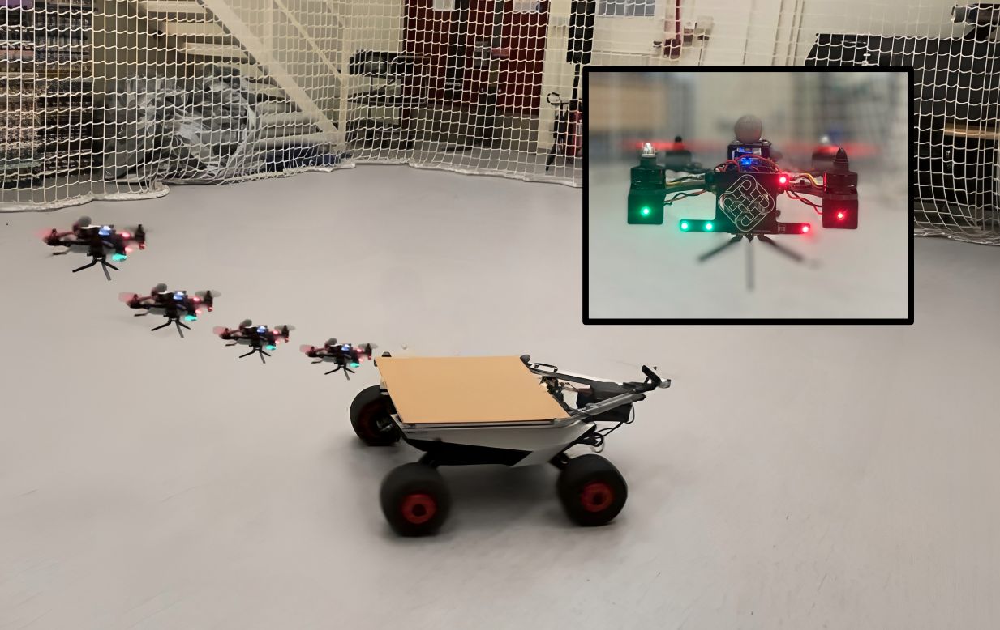
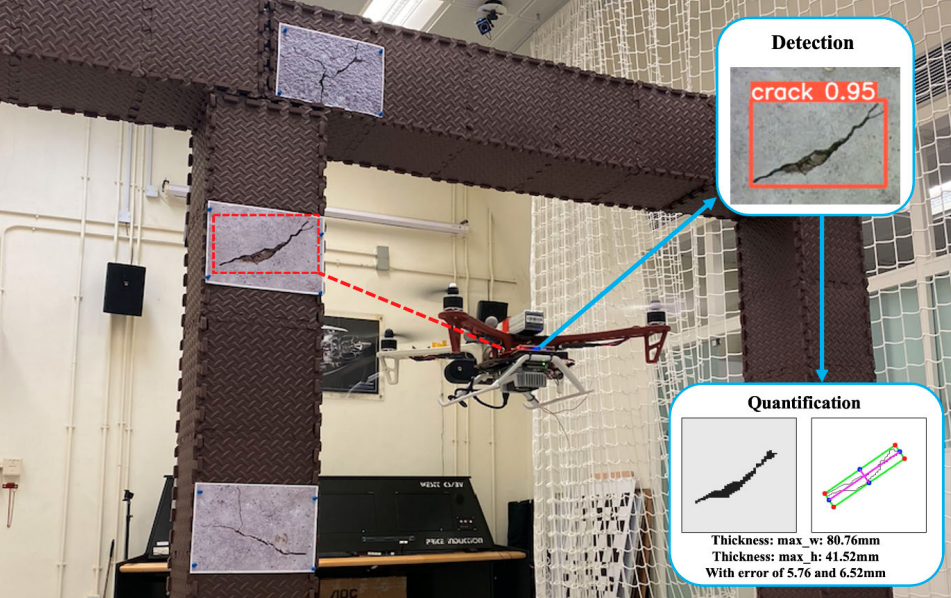

<!--   -->
<!-- Include Bootstrap CSS (You can use a CDN link) -->
<!-- <link rel="stylesheet" href="https://maxcdn.bootstrapcdn.com/bootstrap/4.5.2/css/bootstrap.min.css"> -->

<!-- Include Bootstrap JS (You can use a CDN link) -->
<!-- 

 -->

# About Us

        

Welcome to the Autonomous and Intelligent Robotics Lab (AIRO Lab)! We are one of the member of the Research Centre for Unmanned Autonomous Systems, of the Department of Aeronautical and Aviation Engineering of The Hong Kong Polytechnic University. Feel free to browse through our research paper <a href="/publications">(click me)</a> and code <a href="https://github.com/HKPolyU-UAV">(click me)</a>; drop us an email or issue for any discussion!      

  <!-- Indicators -->
  <ul class="carousel-indicators">
    <li data-target="#imageCarousel" data-slide-to="0" class="active"></li>
    <li data-target="#imageCarousel" data-slide-to="1"></li>
    <li data-target="#imageCarousel" data-slide-to="2"></li>
  </ul>

  <!-- The slideshow -->
  

    

      
    

    

      
    

    

      
    

  

  <!-- Left and right controls -->
  <a class="carousel-control-prev" href="#imageCarousel" data-slide="prev">
    
  </a>
  <a class="carousel-control-next" href="#imageCarousel" data-slide="next">
    
  </a>

