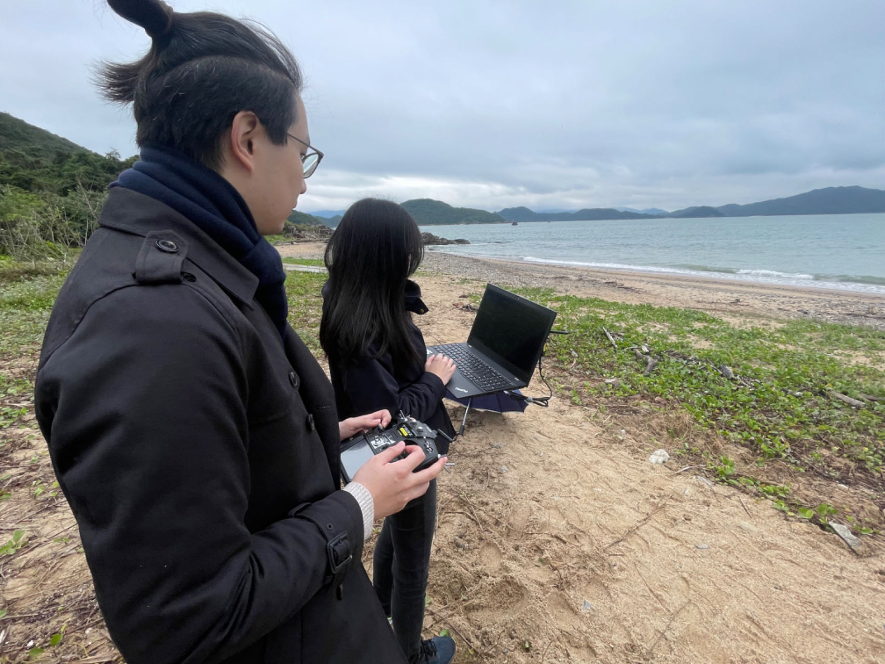
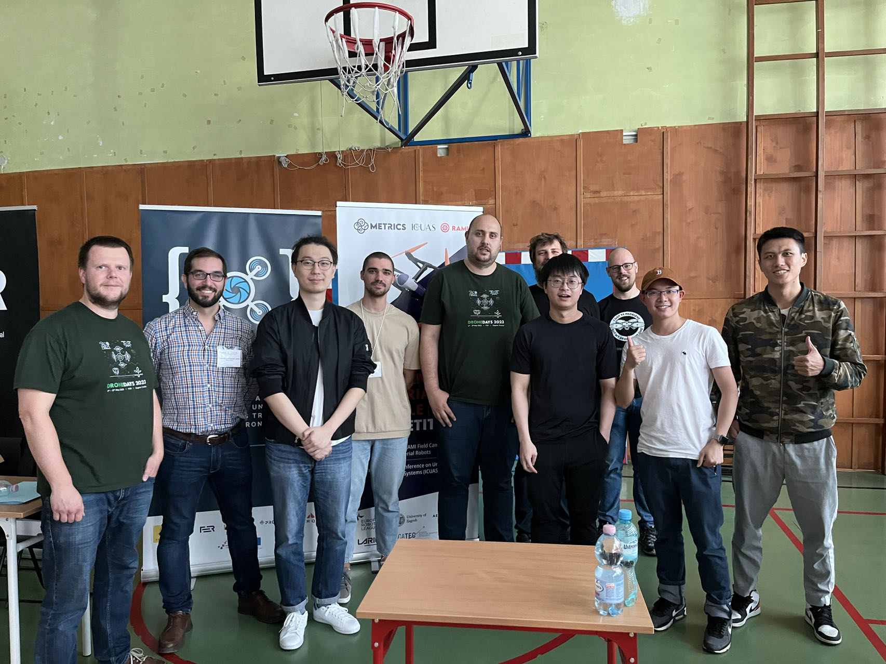
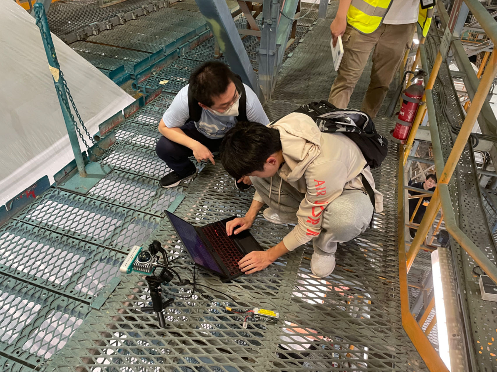

# Join Us!

<!--   -->
<!-- Include Bootstrap CSS (You can use a CDN link) -->
<!-- <link rel="stylesheet" href="https://maxcdn.bootstrapcdn.com/bootstrap/4.5.2/css/bootstrap.min.css"> -->

  <!-- Indicators -->
  <ul class="carousel-indicators">
    <li data-target="#imageCarousel" data-slide-to="0" class="active"></li>
    <li data-target="#imageCarousel" data-slide-to="1"></li>
    <li data-target="#imageCarousel" data-slide-to="2"></li>
  </ul>

  <!-- The slideshow -->
  

    

      
    

    

      
    

    

      
    

  

  <!-- Left and right controls -->
  <a class="carousel-control-prev" href="#imageCarousel" data-slide="prev">
    
  </a>
  <a class="carousel-control-next" href="#imageCarousel" data-slide="next">
    
  </a>

<!-- Include Bootstrap JS (You can use a CDN link) -->
<!-- 

 -->

 We are always looking for outstanding and passionate students out there who are interested in the field of robotics and control. Feel free to contact us via <a href="cywen@polyu.edu.hk">email</a>, or drop a message to our lab members!

